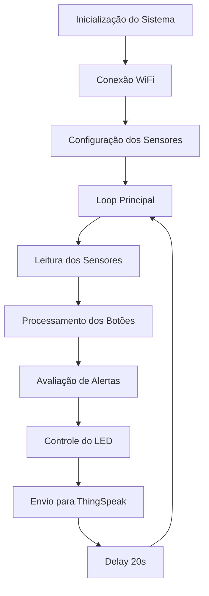

# 🏢 WorkSafe IoT - Monitor de Bem-Estar e Saúde no Trabalho

## 📋 Descrição do Projeto

O **WorkSafe IoT** é uma solução inteligente de monitoramento de bem-estar e saúde no trabalho, especialmente desenvolvida para ambientes híbridos e remotos. O sistema utiliza um ESP32 equipado com sensores para coletar dados ambientais e de saúde em tempo real, fornecendo alertas e insights para melhorar a qualidade de vida no trabalho.

### 🎯 Finalidade

- **Monitoramento Ambiental**: Controle de temperatura, umidade e luminosidade do ambiente de trabalho
- **Simulação de Saúde**: Monitoramento simulado de batimentos cardíacos através de potenciômetro
- **Interface Interativa**: Botões para indicar estado de humor e necessidade de pausas
- **Alertas Inteligentes**: Sistema de LED para alertas visuais baseados nos parâmetros monitorados
- **Conectividade IoT**: Envio de dados para plataforma ThingSpeak para análise e visualização

## 👥 Equipe de Desenvolvimento

- **Kaue Vinicius Samartino da Silva** - 559317
- **João dos Santos Cardoso de Jesus** - 560400  
- **Davi Praxedes Santos Silva** - 560719

## 🔧 Componentes do Sistema

### Hardware Simulado (Wokwi)
- **ESP32 DevKit v1**: Microcontrolador principal
- **DHT22**: Sensor de temperatura e umidade
- **Potenciômetro**: Simulação de batimentos cardíacos
- **LDR (Fotoresistor)**: Sensor de luminosidade
- **2x Botões Push**: Controle de humor e pausas
- **LED Vermelho**: Indicador de alerta
- **Resistores**: 3x 1kΩ para pull-up e limitação de corrente

### Software
- **Arduino IDE/PlatformIO**: Desenvolvimento do firmware
- **Bibliotecas**:
  - WiFi: Conectividade wireless
  - ThingSpeak: Comunicação IoT
  - DHT sensor library: Leitura do sensor DHT22
  - Adafruit Sensor: Biblioteca base para sensores

## 🚀 Como Executar no Wokwi Simulator

### Pré-requisitos
- Navegador web moderno (Chrome, Firefox, Safari, Edge)
- Conta no [Wokwi](https://wokwi.com) (opcional, mas recomendado)
- Conta no [ThingSpeak](https://thingspeak.com) para visualização dos dados

### Passo 1: Configuração do ThingSpeak

1. Acesse [ThingSpeak.com](https://thingspeak.com) e crie uma conta gratuita
2. Crie um novo canal (New Channel)
3. Configure os campos:
   - Field 1: Temperatura (°C)
   - Field 2: Umidade (%)
   - Field 3: Batimento Simulado
   - Field 4: Luminosidade
   - Field 5: Estado do Humor (0/1)
   - Field 6: Solicitação de Pausa (0/1)
4. Anote o **Channel ID** e **Write API Key**

### Passo 2: Configuração do Código

1. Abra o arquivo `q1/src/app.cpp`
2. Substitua as credenciais do ThingSpeak:
```cpp
unsigned long channelID = SEU_CHANNEL_ID; // Substitua pelo seu Channel ID
const char* writeAPIKey = "SUA_WRITE_API_KEY"; // Substitua pela sua Write API Key
```

### Passo 3: Executar no Wokwi

#### Opção A: Usar o Projeto Existente
1. Acesse [Wokwi](https://wokwi.com)
2. Clique em "New Project" → "ESP32"
3. Copie o conteúdo do arquivo `app.cpp` para o editor
4. Copie o conteúdo do arquivo `diagram.json` e cole no editor de diagrama (aba "diagram.json")
5. Clique em "Start Simulation"

#### Opção B: Importar o Projeto
1. No Wokwi, use a opção "Import" e carregue os arquivos do projeto
2. Ajuste as configurações se necessário
3. Inicie a simulação

### Passo 4: Interação com a Simulação

#### Controles Disponíveis:
- **Potenciômetro**: Gire para simular diferentes batimentos cardíacos (0-4095)
- **Sensor DHT22**: Simula temperatura e umidade ambiente
- **LDR**: Simula diferentes condições de luminosidade
- **Botão Verde (Mood)**: Alterna entre estado de bem-estar e alerta
- **Botão Verde (Pause)**: Solicita ou cancela pausa

#### Indicadores:
- **LED Vermelho**: Acende quando há algum alerta:
  - Temperatura > 28°C
  - Umidade < 35%
  - Estado de humor em alerta
  - Solicitação de pausa ativa
  - Batimento simulado > 2000

## 📊 Monitoramento dos Dados

### Via Serial Monitor (Wokwi)
- Abra o Serial Monitor na simulação
- Observe os dados sendo coletados e enviados
- Acompanhe o status das conexões WiFi e ThingSpeak

### Via ThingSpeak
1. Acesse seu canal no ThingSpeak
2. Visualize os gráficos em tempo real
3. Configure alertas e notificações
4. Exporte dados para análise

## ⚙️ Configuração e Parâmetros

### Intervalos de Monitoramento
- **Coleta de dados**: Contínua
- **Envio para ThingSpeak**: A cada 20 segundos (limite da API gratuita)

### Thresholds de Alerta
- **Temperatura**: > 28°C
- **Umidade**: < 35%
- **Batimento simulado**: > 2000
- **Mood/Pausa**: Estados ativos (1)

### Configurações de Rede
- **SSID**: "Wokwi-GUEST" (padrão do simulador)
- **Password**: "" (vazio para o simulador)

## 🔄 Fluxo de Funcionamento



## 🛠️ Troubleshooting

### Problemas Comuns

#### Simulação não inicia:
- Verifique se todos os componentes estão conectados corretamente
- Confirme se o código não possui erros de sintaxe

#### Dados não aparecem no ThingSpeak:
- Verifique as credenciais (Channel ID e API Key)
- Confirme a conexão WiFi no Serial Monitor
- Verifique se não está excedendo o limite de requisições (15s mínimo)

#### LED não acende:
- Verifique as conexões do LED e resistor
- Teste os sensores individualmente
- Confirme os thresholds de alerta

### Logs de Debug
O Serial Monitor fornece informações detalhadas sobre:
- Status da conexão WiFi
- Valores dos sensores em tempo real
- Status de envio para ThingSpeak
- Estados dos botões

## 📈 Possíveis Melhorias

### Versão Física
- Adicionar display OLED para feedback local
- Implementar buzzer para alertas sonoros
- Integrar sensor de movimento (PIR)
- Adicionar sensor de qualidade do ar

### Software
- Interface web local para configuração
- Algoritmos de machine learning para padrões
- Notificações push via aplicativo móvel
- Integração com assistentes virtuais

## 📝 Licença

Este projeto é desenvolvido para fins educacionais e pode ser utilizado livremente para aprendizado e desenvolvimento.

---

**Nota**: Este projeto utiliza o simulador Wokwi para demonstração. Para implementação física, ajustes nas conexões e configurações podem ser necessários.